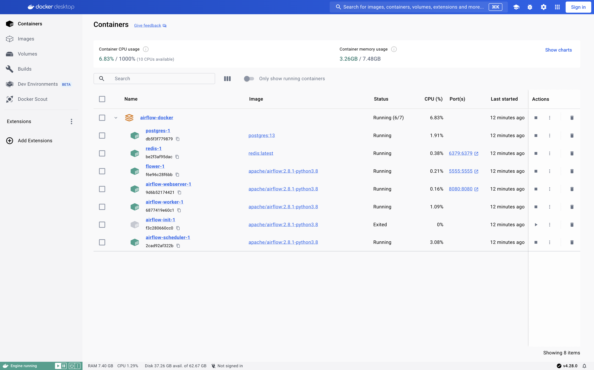
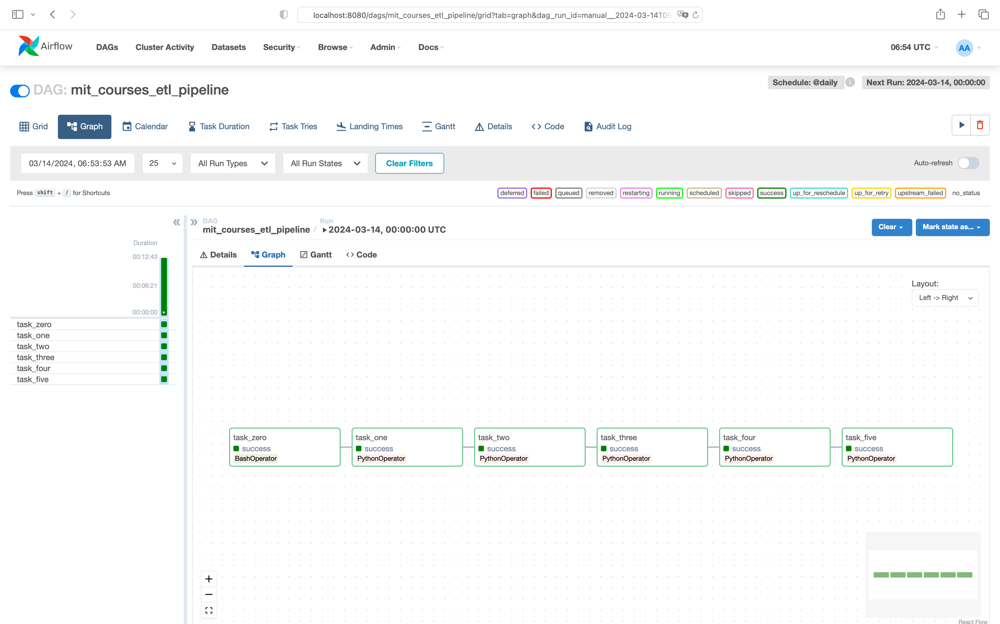
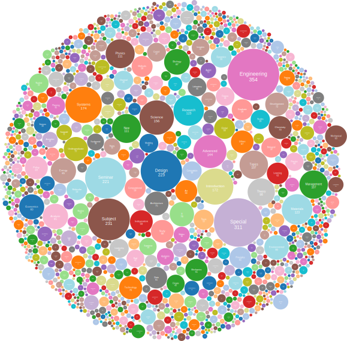

<div style="position: fixed; bottom: 0; left: 0; width: 100%; background-color: #ffffff; border-top: 1px solid #cccccc; padding: 10px; text-align: center; z-index: 1000;">
    <a href="https://siconge.github.io/">Back to Portfolio</a>
</div>

### Design ETL Pipeline by Defining Python Tasks and Dependencies
- Define tasks for each step of the ETL process, along with their dependencies, in the **mit_courses_etl_pipeline.py** file within the **airflow-docker/dags** directory.


```python
# DAG object and operators
from airflow import DAG
from airflow.operators.bash import BashOperator
from airflow.operators.python import PythonOperator
from airflow.utils.dates import days_ago

# Task facilitating functions
import urllib.request
import time
import glob, os
import json
```


```python
# Helper function for requesting and parsing data from an data source URL
def pull(url):
    with urllib.request.urlopen(url) as url:
        return url.read().decode('utf-8')

# Helper function for storing data in a HTML file 
def store_html(data, file):
    with open(file, 'w') as f:
        f.write(data)
    print('wrote file: ' + file)

# Helper function for storing data in a JSON file
def store_json(data, file):
    with open(file, 'w', encoding='utf-8') as f:
        json.dump(data, f, ensure_ascii=False, indent=4)
    print('wrote file: ' + file)
```


```python
# TASK 1 - Pull course catalog pages

def catalog():
    
    # Create a list that contains the working URLs as strings
    dag_dir = os.path.dirname(os.path.abspath(__file__))
    file_path = os.path.join(dag_dir, 'mit_courses_urls.txt')
    with open(file_path, 'r') as f:
        urls = f.read().split('\n')
    
    # Store parsed data into the corresponding file named with a URL suffix (e.g. m1a.html)
    for url in urls:
        data = pull(url)
        index = url.rfind('/') + 1
        file = url[index:]
        store_html(data, file)
        print('pulled: ' + file)
        print('--- waiting ---')

        # Allow for sleep time between consecutive requests to avoid triggering security measures on target server
        time.sleep(15)
```


```python
# TASK 2 - Concatenate all files into a combo file

def combine():
    with open('combo.txt', 'w') as outfile:
        for file in glob.glob('*.html'):
            with open(file) as infile:
                outfile.write(infile.read())
```


```python
# TASK 3 - Store course titles scraped from HTML in a JSON file

def titles():    
    
    # Preprocess HTML text data in 'combo.txt' generated by TASK 2 by handling line breaks and carriage returns 
    with open('combo.txt', 'r') as f:
        html = f.read().replace('\n', ' ').replace('\r', '')
    
    # Create a HTML parser using BeautifulSoup
    from bs4 import BeautifulSoup
    soup = BeautifulSoup(html, 'html.parser') 
    results = soup.find_all('h3')

    # Store the text content of the specified tag in a list
    titles = []
    for item in results:
        titles.append(item.text)
    
    store_json(titles, 'titles.json')
```


```python
# TASK 4 - Perform data cleaning for stored course titles

def clean():
    
    # Set up stopwords using NLTK Library
    import nltk
    from nltk.corpus import stopwords
    nltk.download('stopwords')
    nltk.download('punkt')
    stop_words = set(stopwords.words('english'))
    
    with open('titles.json', 'r') as f:
        titles = json.load(f)
    
    # Tokenize and filter titles by removing punctuation, numbers, and stopwords, then update the title list
    for idx, title in enumerate(titles):
        tokens = nltk.word_tokenize(title)
        filtered_tokens = [word for word in tokens
                           if word.isalpha() and word.lower() not in stop_words and len(word)>1]
        titles[idx] = ' '.join(filtered_tokens)
    
    store_json(titles, 'titles_clean.json')
```


```python
# TASK 5 - Count word frequency of cleaned course titles

def count_words():
    with open('titles_clean.json', 'r') as f:
        titles = json.load(f)
    
    # Extract words and flatten
    words = []
    for title in titles:
        words.extend(title.split())
    
    # Count word frequency
    from collections import Counter
    counts = Counter(words)
    
    store_json(counts, 'words.json')
```


```python
# Instantiate a DAG object and design an Airflow pipeline

with DAG(
    'mit_courses_etl_pipeline',
    start_date=days_ago(1),
    schedule_interval='@daily',catchup=False,
) as dag:
    
    # Create tasks by instantiating operators
    t0 = BashOperator(task_id='task_zero', bash_command='pip install beautifulsoup4 && pip install nltk', retries=2)
    t1 = PythonOperator(task_id='task_one', depends_on_past=False, python_callable=catalog)
    t2 = PythonOperator(task_id='task_two', depends_on_past=False, python_callable=combine)
    t3 = PythonOperator(task_id='task_three', depends_on_past=False, python_callable=titles)
    t4 = PythonOperator(task_id='task_four', depends_on_past=False, python_callable=clean)
    t5 = PythonOperator(task_id='task_five', depends_on_past=False, python_callable=count_words)

    # Chain multiple dependencies between tasks
    t0 >> t1 >> t2 >> t3 >> t4 >> t5
```

### Instantiate an Airflow Web Server within Docker Containers to Handle Defined Python Tasks

- STEP 1: Initiate Airflow containers by running the `docker-compose up` command in a Terminal window within the **airflow-docker** directory, where the **docker-compose.yaml** configuration file is located.
- STEP 2: Access Airflow UI by navigatinig to https://localhost:8080 in the browser.
- STEP 3: Select and trigger the **mit_courses_etl_pipeline** DAG. Once the DAG has finished running, switch to the Graph view displaying the success status of all tasks in the DAG.





### Perform File Migration and Data Restructuring for D3 Visualization
- STEP 1: Run the docker command in the host machine's terminal window to transfer the **words.json** file generated by the **mit_courses_etl_pipeline** DAG from the **airflow-docker-airflow-worker-1** container to the **code_visualization** directory.
- STEP 2: Execute the **copy_dump_json.py** script within the **code_visualization** directory to restructure the data from the **words.json** file into a format that ensures the data follows the structure expected by *d3.hierarchy*, with the key *"children"* containing a list of dictionaries, each representing a word and its count. The restructured data is converted into a JSON string stored in the **words.js** file within the **code_visualization** directory. This file serves as the input linked in the **d3_bubble_chart.html** file in the same directory to generate a bubble chart of word frequencies.
- STEP 3: Display the bubble chart of word frequencies generated by the **d3_bubble_chart.html** file in the browser.


```python
# Docker copy 

import json, os

# Copy 'words.json' from Airflow container's file system to the host machine
file_path = os.path.join(os.getcwd(), 'words.json')
cmd = f'docker cp airflow-docker-airflow-worker-1:/opt/airflow/words.json {file_path}'
result = os.system(cmd)
if result == 0:
    print('words.json created')

# Read data from 'words.json' and load it into a Python dictionary
with open('words.json', 'r') as f:
    data = json.load(f)

# Restructure the data into a list of dictionaries for JavaScript usage
freq_dict = {'words':[{'Name':key, 'Count':value} for key, value in data.items()]}

# Convert the restructured data into a JSON string and write it to 'words.js'
js_content = 'freq_dict = ' + json.dumps(freq_dict, indent=4) + ';'
with open('words.js', 'w') as f:
    f.write(js_content)
print('words.js created')
```

```html
<!DOCTYPE html>
<html lang="en">
<head>
	<meta charset="utf-8">
		<title>D3: A simple packed Bubble Chart</title>

        <!-- Import D3 library without installing it locally -->
		<script type="text/javascript" src="https://d3js.org/d3.v4.min.js"></script>
        
        <!-- Import the preprocessed data set with the expected structure -->
        <script type="text/javascript" src="words.js"></script>
</head>
<body>
	<script type="text/javascript">

        // Assign the entire content of the freq_dict object from the "words.js" file to dataset
        dataset = freq_dict;

        var diameter = 1500;
        
        var color = d3.scaleOrdinal(d3.schemeCategory20);

        var bubble = d3.pack(dataset)
            .size([diameter, diameter])
            .padding(1.5);

        var svg = d3.select("body")
            .append("svg")
            .attr("width", diameter)
            .attr("height", diameter)
            .attr("class", "bubble");

        var nodes = d3.hierarchy(dataset)
            .sum(function(d) { return d.Count; });

        var node = svg.selectAll(".node")
            .data(bubble(nodes).descendants())
            .enter()
            .filter(function(d){
                return  !d.children
            })
            .append("g")
            .attr("class", "node")
            .attr("transform", function(d) {
                return "translate(" + d.x + "," + d.y + ")";
            });

        // Define the bubbles for the diagram on HTML page
        node.append("circle")
            .attr("r", function(d) {
                return d.r;
            })
            .style("fill", function(d,i) {
                return color(i);
            });

        // Add a name label to each word's bubble, with font size scaled by the corresponding bubble size
        node.append("text")
            .attr("dy", ".2em")
            .style("text-anchor", "middle")
            .text(function(d) {
                return d.data.Name.substring(0, d.r / 3);
            })
            .attr("font-family", "sans-serif")
            .attr("font-size", function(d){
                return d.r/5;
            })
            .attr("fill", "white");

        // Add a count label to each word's bubble, with font size scaled by the corresponding bubble size
        node.append("text")
            .attr("dy", "1.3em")
            .style("text-anchor", "middle")
            .text(function(d) {
                return d.data.Count;
            })
            .attr("font-family",  "Gill Sans", "Gill Sans MT")
            .attr("font-size", function(d){
                return d.r/5;
            })
            .attr("fill", "white");

        d3.select(self.frameElement)
            .style("height", diameter + "px");
	
    </script>
</body>
</html>
```


